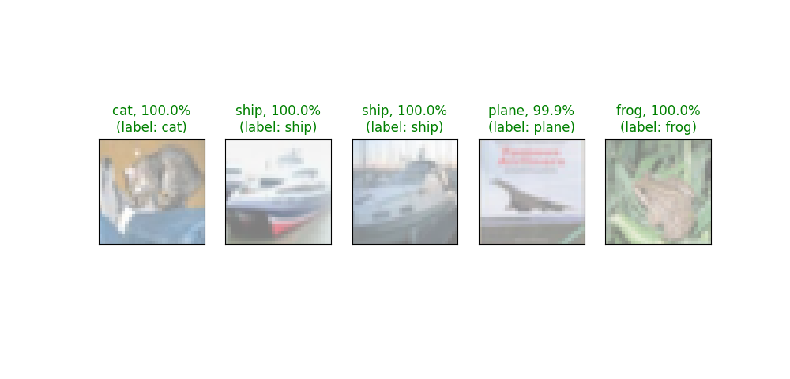
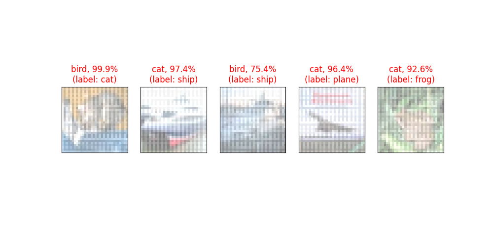

# Under Progress #

## Limited-pixel-attack-reinforcement-learning
Novel method of performing limited pixel adversarial attacks using Reinforcement Learning.
The number of pixels that can be changed, i.e. the L0 norm calculated between the original image and the generated adversarial sample is constrained.

The proposed architecture has three parts 
- A network for estimating the vulnerability of each pixel
- A sampling layer to select the vulnerable pixels.
- A network to generate perturbations.

The sampling layer outputs a mask of 0s and 1s that represents the vulnerable pixels that are to be perturbed. Since sampling is a non-differentiable operation, the network that estimates the pixel vulnerability cannot be trained using backprop. Instead, a reinforcement learning algorithm (REINFORCE) is used.

A modified Adversarial GAN (AdvGAN) is used to generate perturbations. The input to the AdvGAN is the original image and the pixel mask, and the perturbation obtained as the output of the AdvGAN is multiplied with the pixel mask before adding it to the original image so that only the selected pixels are perturbed. The AdvGAN can be trained using Backprop.

The current issue with this architecture is that although the reward function for reinforcement learning penalizes every pixel modified, the number of pixels modified is still high (~48%).

Efforts are being made to resolve this problem by adding loss functions to restrict the perturbations generated by the AdvGAN to the regions in the pixel mask with the value one. Changes to the reward functions are also being explored.

## Results 

  <b>Original Images with Class Labels</b> 

  <b>Generated Adversarial Samples with Misclassified Class Labels</b> 

